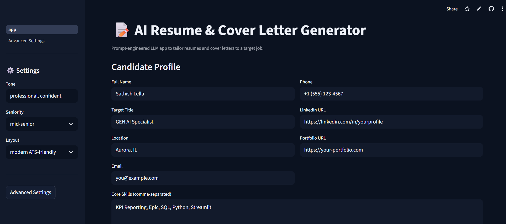
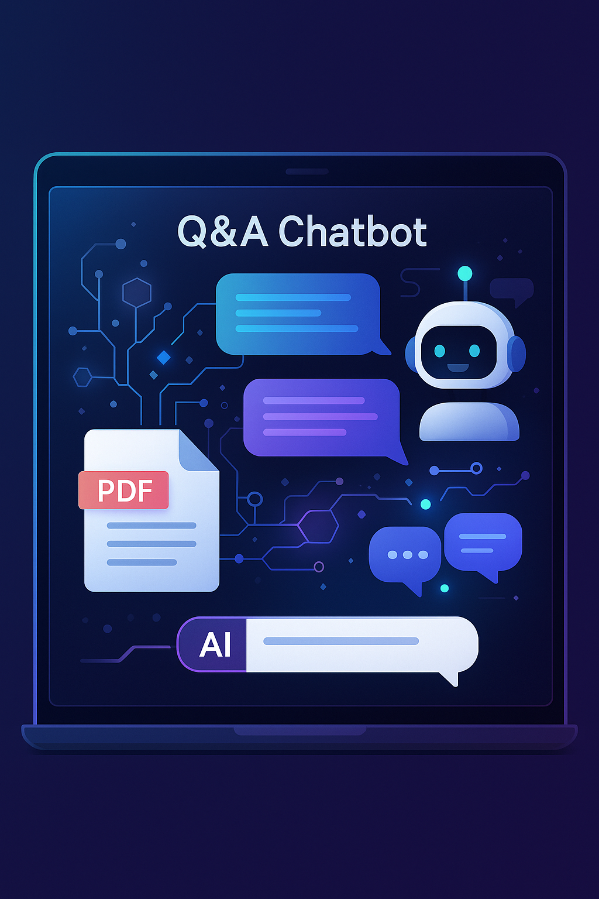
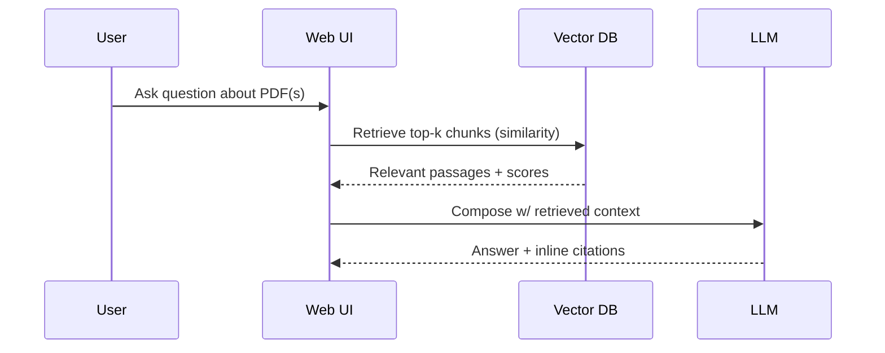
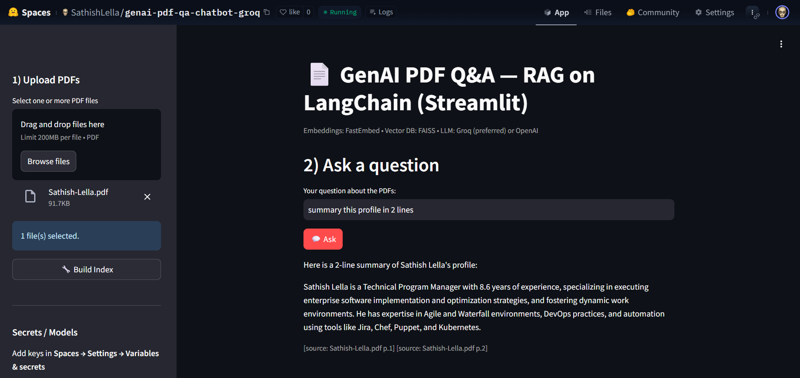
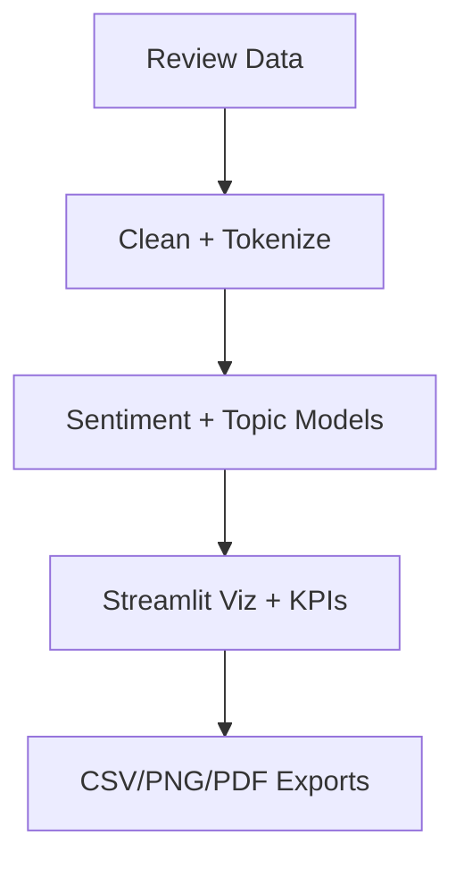

<h1 align="center">✨ AI Engineer Portfolio — Sreeja Akuthota ✨</h1>

<p align="center">
  
</p>

<p align="center">
  <a href="mailto:sreejaakuthota07@gmail.com"></a>
  <a href="https://www.linkedin.com/in/sreeja-akuthota/"></a>
  
  
</p>

<p align="center">
  
  
  
  
  
  
  
  
  
  
  
  
  
  
  
</p>

---

## 🚀 Featured Projects

<details open>
<summary><strong>Project 1 — AI Resume & Cover Letter Generator</strong> · <em>NLP</em></summary>

**Live:** <a href="https://ai-resume-coverletter-generator.streamlit.app/">Streamlit Cloud</a>  
**Key Skills:** Prompt engineering, LLM text generation  
**Stack:** Python · Streamlit · FastAPI (optional API) · OpenAI/HF Inference API · Prompt Templates

<p align="center">
  
  <br/>
</p>

**Highlights**
- One-click generation of tailored resume bullets and cover letters from a job description.
- Guardrails & prompt-chains for tone, length, and ATS keyword coverage.
- Export to PDF/Markdown; reusable prompt presets per role.


<details open>
<summary><strong>Project 2 — Gen AI PDF Q&A Chatbot</strong> · <em>RAG / LangChain</em></summary>

**Live:** <a href="https://huggingface.co/spaces/Sreeja007/genai-pdf-qa-chatbot-groq">Hugging Face Spaces</a>  
**Key Skills:** Embeddings, vector database, retrieval  
**Stack:** Python · LangChain · FAISS/Chroma · Hugging Face · Streamlit/Gradio

<p align="center">
  
  <br/>
</p>

**Highlights**
- Drop PDFs and chat with them using contextual retrieval.
- Persistent vector store; sources with confidence scores.
- Chunking + re-ranking; streaming responses w/ citations.



**Run locally**
```bash
pip install -r requirements.txt
python -m scripts/ingest --path data/pdfs
streamlit run apps/pdf_chat.py
```
</details>

---

<details open>
<summary><strong>Project 3 — AI Review Sentiment Dashboard</strong> · <em>Data + AI</em></summary>

**Live:** <a href="https://ai-review-sentiment-dashboard.streamlit.app/">Streamlit Cloud (replace link)</a>  
**Key Skills:** NLP analysis, data visualization  
**Stack:** Python · Pandas · scikit-learn/HF · Streamlit · Plotly · Power BI/Tableau (optional)

<p align="center">
  
  <br/>
</p>

**Highlights**
- Ingest CSV/JSON reviews; classify sentiment and key themes.
- Trend lines, word clouds, and cohort breakdowns.
- Export annotated dataset and executive-ready charts.



**Run locally**
```bash
pip install -r requirements.txt
streamlit run apps/sentiment_dashboard.py
```
</details>

---

## ✨ Demos (Add your GIFs)
Put short demos in `assets/` and reference them here.
<p align="center">
  <br/>
  <br/>
  
</p>

---

## 👩🏽‍💻 About Me
AI Engineer with 5+ years building ML/NLP products end‑to‑end—data → models → cloud deployment → dashboards. Experience spans healthcare and insurance, productionizing models on AWS SageMaker, Azure ML, and Vertex AI; building RAG workflows; and shipping BI dashboards that drive decisions. Highlights:
- +22% NLP accuracy with HF Transformers on SageMaker.
- −20% inference latency via Dockerized PyTorch + FastAPI.
- −35% manual reporting with automated BI + anomaly detection.
- +40% dataset accuracy through ML‑validated SQL pipelines.

> Email: <a href="mailto:sreejaakuthota07@gmail.com">sreejaakuthota07@gmail.com</a> · 
> LinkedIn: <a href="https://www.linkedin.com/in/sreeja-akuthota/">sreeja-akuthota</a>

---

## 🧱 Repo Layout (suggested)
```
.
├── apps/
│   ├── resume_app.py
│   ├── pdf_chat.py
│   └── sentiment_dashboard.py
├── scripts/
│   └── ingest.py
├── requirements.txt
├── assets/
│   ├── demo_resume.gif
│   ├── demo_pdfqa.gif
│   └── demo_sentiment.gif
└── README.md
```

---

## ⚙️ Quick Setup
```bash
# 1) Create env
python -m venv .venv && source .venv/bin/activate  # on Windows: .venv\Scripts\activate
# 2) Install deps
pip install -r requirements.txt
# 3) (Optional) set API keys
export OPENAI_API_KEY=...         # or HUGGINGFACEHUB_API_TOKEN=...
export LANGCHAIN_TRACING_V2=true  # if you want observability
```

**requirements.txt (suggested)**
```
streamlit
fastapi
uvicorn
langchain
faiss-cpu
chromadb
pydantic
python-dotenv
pandas
numpy
scikit-learn
matplotlib
plotly
transformers
torch
sentence-transformers
tabulate
```

---

## 🧪 Test & Quality
- Unit tests for chunking, retrieval, and prompt templates.
- Smoke tests for APIs (`uvicorn apps:app --reload`).
- Lint/format: `ruff`, `black`, `mypy` (optional).

---

## ☁️ Deploy
- **Streamlit Cloud**: Push repo → New app → Select `apps/resume_app.py` or `apps/sentiment_dashboard.py`.
- **Hugging Face Spaces**: Space → Gradio/Streamlit → set `requirements.txt` + `HF_TOKEN`.
- **Containers**: `docker build -t ai-portfolio . && docker run -p 8501:8501 ai-portfolio`.

---


## 🏆 Activity & Stats
<p align="center">
  
  
</p>
<p align="center">
  
</p>

<p align="center">
  
</p>

